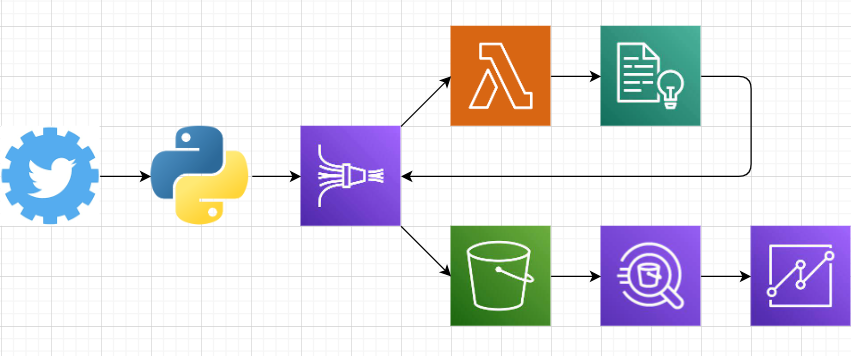
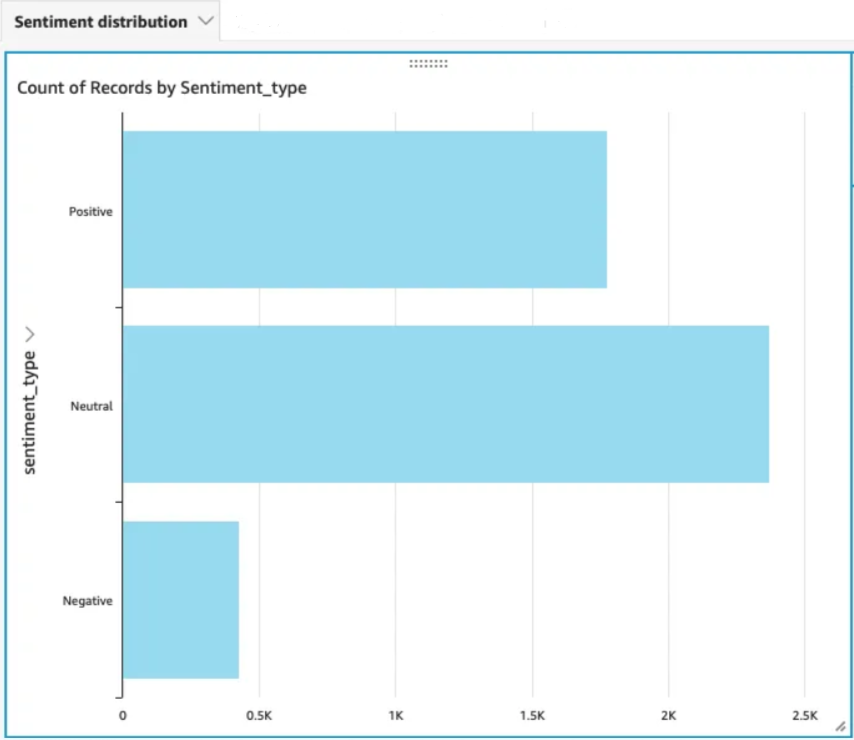

# Twitter Sentiment Analysis
This deisgn project enables the analysis of live tweets that are filtered using certain keywords and focuses on a completely AWS dependent pipeline to fulfill this process. AWS tools used include Kinesis Data Firehose, Lambda, Comprehend, S3, Athena, & Quicksight:

The general process flow of data is as follows:
1) Raw tweet data is pulled with help from the Twitter API
2) With the help of a python script, tweets are then streamed into Kinesis Firehose
3) Kinesis passes this data to Lambda who then passes this data to Comprehend
4) Comprehend then analyzes the tweet data and determines whether the sentiment of the tweets are Positive, Negative, or Neutral
5) This analysis results are finally sent to S3
6) Athena analyzes these results and passes this onto Quicksight
7) Filtered results are now viewable on Quicksight

Taking a look back, my intial design pipeline was not feasible as I was relying on OpenSearch for sentiment analysis. Now I am relying on comprehend, which is a machine learning tool deisgned to analyze text and better suits my needs for sentiment analysis.

Some obstacles I faced in making my design was trying to stay in the AWS Free Tier. This was due to time constraints, like I faced when using the Quicksight free trial, or even with limited character analysis with Comprehend. Ultimately, I was forced, with every test or every run of my system, to not waste time or calls.

The following are my results, as diplayed on a Quicksight bar chart:

Future work would entail incorporating futher analysis tools in this data pipeline that can display even more information pulled from tweet data. To make this data accessible in the future, the quicksight dashboards can be displayed on a static webpage.